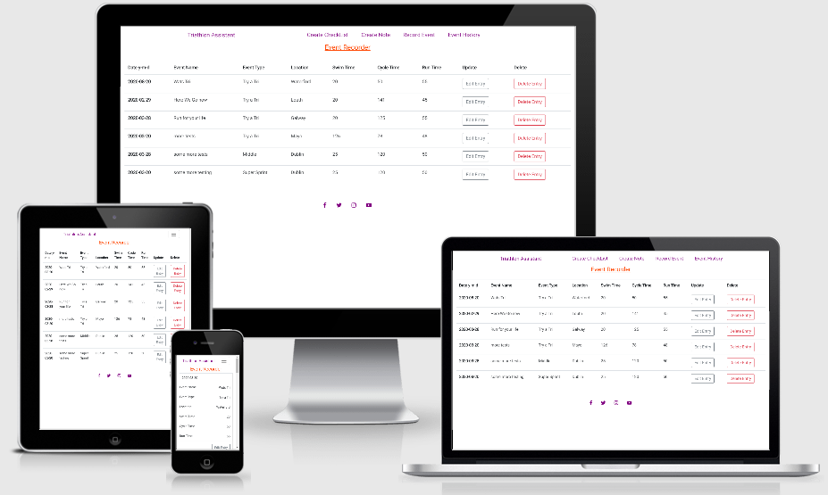

# Code Institute

 

    <article class="markdown-body entry-content p-3 p-md-6" itemprop="text"><h1><a id="user-content-your-projects-name" class="anchor" aria-hidden="true" href="#your-projects-name"><svg class="octicon octicon-link" viewBox="0 0 16 16" version="1.1" width="16" height="16" aria-hidden="true"><path fill-rule="evenodd" d="M4 9h1v1H4c-1.5 0-3-1.69-3-3.5S2.55 3 4 3h4c1.45 0 3 1.69 3 3.5 0 1.41-.91 2.72-2 3.25V8.59c.58-.45 1-1.27 1-2.09C10 5.22 8.98 4 8 4H4c-.98 0-2 1.22-2 2.5S3 9 4 9zm9-3h-1v1h1c1 0 2 1.22 2 2.5S13.98 12 13 12H9c-.98 0-2-1.22-2-2.5 0-.83.42-1.64 1-2.09V6.25c-1.09.53-2 1.84-2 3.25C6 11.31 7.55 13 9 13h4c1.45 0 3-1.69 3-3.5S14.5 6 13 6z"></path></svg>
    </a>Triathlon Assistant</h1>

This website is used to present triathlon information to a user, it has a simple to use layout which is easy to navigate,
It has three main pages used for the displaying of triathlon related information such as a checklist for the equipment that you
would require for each event based on the disciplines that you are competing in.
The second page is an events page where you can input upcoming events  and where you can also record completed events and the differant discipline
times. The third page is used to record notes regarding the events.
Each page has a connected edit page which allows the user to update and delete any records that they make.
This project has been deployed to heroku and can be viewed <a href="https://triathlon-assistant.herokuapp.com/" target="_blank">here.</a>
The projects repository can be viewed <a href="https://github.com/johnj974/triathlon-checklist" target="_blank">here.</a> 

<h2><a id="user-content-ux" class="anchor" aria-hidden="true" href="#ux"><svg class="octicon octicon-link" viewBox="0 0 16 16" version="1.1" width="16" height="16" aria-hidden="true"><path fill-rule="evenodd" d="M4 9h1v1H4c-1.5 0-3-1.69-3-3.5S2.55 3 4 3h4c1.45 0 3 1.69 3 3.5 0 1.41-.91 2.72-2 3.25V8.59c.58-.45 1-1.27 1-2.09C10 5.22 8.98 4 8 4H4c-.98 0-2 1.22-2 2.5S3 9 4 9zm9-3h-1v1h1c1 0 2 1.22 2 2.5S13.98 12 13 12H9c-.98 0-2-1.22-2-2.5 0-.83.42-1.64 1-2.09V6.25c-1.09.53-2 1.84-2 3.25C6 11.31 7.55 13 9 13h4c1.45 0 3-1.69 3-3.5S14.5 6 13 6z"></path></svg>
</a>UX</h2>
<h3>Strategy</h3>

The strategy for the site was to make a simple user friendly app that could be used by anyone who is involved or who wishes to try
 a triathlon, A lot of people when they are considering doing a triathlon for the first time only do one of the disciplines as part of a team
 I made this app as an assistant to a triathlete to make a checklist of equipment they use for each discipline and to also be able to record
 and maintain records of upcoming events and of previous event times and also to record individual observations ina notes section
 I designed the app to be user friendly on both desktop and mobile device, I decided to go with a very minimalistic design
 to record and edit triathlon related information as essentially the main purpose of the site is its CRUD functionallity and
 the clear presentation and interactivity of that data.
 

<h3>Scope</h3>

The scope of the project was to make something user friendly that is targeted at people who want to be able to make records of
   equipment that they may need over the course of a triathlon event and who may wish to record their achievements for future referance.

<h3>Structure</h3>

The structure of the site is a simple design that has three main display pages and each of these pages has a support page where
   you are able to edit the information that is shown on the main pages, originally I had all the edit functions for the three main
   pages linking back to the one edit page but I changed it as I thought it gave the site a cleaner less confusing user experience.
   Each page is linked to the other pages through the top navigation bar.

<h3>Skeleton</h3>

There are attached files showing the original rough drawings for the site.
   The original drawings for the site are differant from the finished site as I found when I designing it with the original
   layout the information was looking too cluttered and cramped so the design of the site changed to accomadate the presentation
   of the data.

<h3>Surface</h3>

Because i chose a minimalistic approach to the design of the site where the focus is on the data I decided to use a single font
   I chose the Roboto font as I felt it has clean lines. I chose to apply colours to just the internal and external links to make
   them stand out, I used heroku purple as all my clickable elements on the page which fade to orange when hovered over. I used the bootstrap
   styled buttons on the site as they matched the minimalist design of the site. I kept the colours of the buttons the same as bootstrap as I
   felt the colours give a good visual representation of what they do, red for delete, green for create and grey for edit.

<h2><a id="user-content-features" class="anchor" aria-hidden="true" href="#features"><svg class="octicon octicon-link" viewBox="0 0 16 16" version="1.1" width="16" height="16" aria-hidden="true"><path fill-rule="evenodd" d="M4 9h1v1H4c-1.5 0-3-1.69-3-3.5S2.55 3 4 3h4c1.45 0 3 1.69 3 3.5 0 1.41-.91 2.72-2 3.25V8.59c.58-.45 1-1.27 1-2.09C10 5.22 8.98 4 8 4H4c-.98 0-2 1.22-2 2.5S3 9 4 9zm9-3h-1v1h1c1 0 2 1.22 2 2.5S13.98 12 13 12H9c-.98 0-2-1.22-2-2.5 0-.83.42-1.64 1-2.09V6.25c-1.09.53-2 1.84-2 3.25C6 11.31 7.55 13 9 13h4c1.45 0 3-1.69 3-3.5S14.5 6 13 6z"></path></svg>
</a>Features</h2>

<ul>
    <li>1. It is a responsive app that works on desktop and mobile devices</li>
    <li>2. You can create an equipment checklist that can be edited.</li>
    <li>3. You can create an event that you can edit and insert individual discipline times into to keep
      a record of events you have posted times in. you can also use it to create events before you
      post a time to act as a visual reminder of upcoming events.</li>
    <li>4. There is a notes page that can be used to store any observations or changes that you may wish to implement.</li>  
</ul>

<h2><a id="user-content-features-left-to-implement" class="anchor" aria-hidden="true" href="#features-left-to-implement"><svg class="octicon octicon-link" viewBox="0 0 16 16" version="1.1" width="16" height="16" aria-hidden="true"><path fill-rule="evenodd" d="M4 9h1v1H4c-1.5 0-3-1.69-3-3.5S2.55 3 4 3h4c1.45 0 3 1.69 3 3.5 0 1.41-.91 2.72-2 3.25V8.59c.58-.45 1-1.27 1-2.09C10 5.22 8.98 4 8 4H4c-.98 0-2 1.22-2 2.5S3 9 4 9zm9-3h-1v1h1c1 0 2 1.22 2 2.5S13.98 12 13 12H9c-.98 0-2-1.22-2-2.5 0-.83.42-1.64 1-2.09V6.25c-1.09.53-2 1.84-2 3.25C6 11.31 7.55 13 9 13h4c1.45 0 3-1.69 3-3.5S14.5 6 13 6z"></path></svg>
</a>Features Left to Implement</h2>

I would in future add an individual login page so that a person could have their own personal information stored privately and they
   would be able to update and delete their own records, I would also add another page for training plans where you could keep a record
   of a plan and update or change it accordingly. The notes page could be used for this feature. 

<h2><a id="user-content-technologies-used" class="anchor" aria-hidden="true" href="#technologies-used"><svg class="octicon octicon-link" viewBox="0 0 16 16" version="1.1" width="16" height="16" aria-hidden="true"><path fill-rule="evenodd" d="M4 9h1v1H4c-1.5 0-3-1.69-3-3.5S2.55 3 4 3h4c1.45 0 3 1.69 3 3.5 0 1.41-.91 2.72-2 3.25V8.59c.58-.45 1-1.27 1-2.09C10 5.22 8.98 4 8 4H4c-.98 0-2 1.22-2 2.5S3 9 4 9zm9-3h-1v1h1c1 0 2 1.22 2 2.5S13.98 12 13 12H9c-.98 0-2-1.22-2-2.5 0-.83.42-1.64 1-2.09V6.25c-1.09.53-2 1.84-2 3.25C6 11.31 7.55 13 9 13h4c1.45 0 3-1.69 3-3.5S14.5 6 13 6z"></path></svg></a>Technologies Used</h2>

<ul>
<li>HTML</li>
<li>CSS</li>
<li>Bootstrap</li>
<li>Python</li>
<li>Flask</li>
<li>MongoDB</li>
<li>Heroku</li>
</ul>

<h2><a id="user-content-testing" class="anchor" aria-hidden="true" href="#testing"><svg class="octicon octicon-link" viewBox="0 0 16 16" version="1.1" width="16" height="16" aria-hidden="true"><path fill-rule="evenodd" d="M4 9h1v1H4c-1.5 0-3-1.69-3-3.5S2.55 3 4 3h4c1.45 0 3 1.69 3 3.5 0 1.41-.91 2.72-2 3.25V8.59c.58-.45 1-1.27 1-2.09C10 5.22 8.98 4 8 4H4c-.98 0-2 1.22-2 2.5S3 9 4 9zm9-3h-1v1h1c1 0 2 1.22 2 2.5S13.98 12 13 12H9c-.98 0-2-1.22-2-2.5 0-.83.42-1.64 1-2.09V6.25c-1.09.53-2 1.84-2 3.25C6 11.31 7.55 13 9 13h4c1.45 0 3-1.69 3-3.5S14.5 6 13 6z"></path></svg>
</a>Testing</h2>

The site was tested on mobile devices manufactured by huawei,apple and samsung.it was tested on laptop devices and desktops  
 of varying sizes and operating systems such as chrome,firefox, and edge, only slight styling changes were observed 
 The following tests were conducted on the site to check functionality.  
 <ul>
 <li>1. All navbar links on all the differant pages were checked and all of them are linked correctly.</li>
 <li>2. The footer links were checked and all of them work and open in a seperate window.</li>
 <li>3. All Create, Edit and Delete buttons were checked on all pages and are working as intended.</li>
 <li>4. All input fields were checked and all inputs are being recorded in the MongoDB database.</li>
 <li>5. All pages when resized are responsive and are easy to navigate.</li>
 </ul>

During manual testing of the site I noticed that on some of the pages the content when expanded was flowing beyond the footer element and
   it was ok on other pages, I had originally wanted to keep the footer to the bottom of the page but I had to change that to accomadate all
   the pages. Initially the events page when viewed on mobile was only side scrollable and seemed to be flowing outside of the parent div
    which messed up the alignment of the header and footer elements on the page which did not look good so
   I used a media query to change the layout of the information presented so that it would appear in a card like display when on a smaller screen.
   

Validation testing was done on all of the code using HTML CSS and PEP8 validators, all errors in CSS and PEP8 validations were fixed.
    

 
 

<h2><a id="user-content-deployment" class="anchor" aria-hidden="true" href="#deployment"><svg class="octicon octicon-link" viewBox="0 0 16 16" version="1.1" width="16" height="16" aria-hidden="true"><path fill-rule="evenodd" d="M4 9h1v1H4c-1.5 0-3-1.69-3-3.5S2.55 3 4 3h4c1.45 0 3 1.69 3 3.5 0 1.41-.91 2.72-2 3.25V8.59c.58-.45 1-1.27 1-2.09C10 5.22 8.98 4 8 4H4c-.98 0-2 1.22-2 2.5S3 9 4 9zm9-3h-1v1h1c1 0 2 1.22 2 2.5S13.98 12 13 12H9c-.98 0-2-1.22-2-2.5 0-.83.42-1.64 1-2.09V6.25c-1.09.53-2 1.84-2 3.25C6 11.31 7.55 13 9 13h4c1.45 0 3-1.69 3-3.5S14.5 6 13 6z"></path></svg>
</a>Deployment</h2>

This site was deployed to Heroku using the command line interface 
   The steps taken to deploy the app were: 
   <ul>
   <li>1. I created a Heroku account</li>
   <li>2. Click on the new button to create the app name I used to run my project.</li>
   <li>3. Choose the region that the server will be based from.</li>
   <li>4. Log into Heroku from the CLI, I needed to provide confirmation using a url.</li>
   <li>5. I insured that the requirements.txt file was installed along with a procfile and that</li>
      all environmental variables were safely hidden in a git ignore file.
   <li>6. Added my files and then commited them to the github repository.</li>
   <li>7. From the Heroku home page that has my app that was created earlier I copied a
      line of code under the Create a new directory that has my application name
      and inserted it into the CLI to create a link between my code and Heroku.</li>
   <li>8. Once that snippet of code runs I typed: git push heroku master to push my</li>
      project to the Heroku server to be run.
   <li>9. Type heroku ps:scale web=1 to start the app, confirmation is when it is scaling dynos</li>
  <li>10. I went back to Heroku, go to settings, go to reveal config vars, input my IP and PORT</li>
      addresses and also add in any variables that are kept in the gitignore file.
  <li>11. When all configs are input I clicked on open app and my project was being hosted by Heroku.</li>
    </ul>
    

<h2><a id="user-content-credits" class="anchor" aria-hidden="true" href="#credits"><svg class="octicon octicon-link" viewBox="0 0 16 16" version="1.1" width="16" height="16" aria-hidden="true"><path fill-rule="evenodd" d="M4 9h1v1H4c-1.5 0-3-1.69-3-3.5S2.55 3 4 3h4c1.45 0 3 1.69 3 3.5 0 1.41-.91 2.72-2 3.25V8.59c.58-.45 1-1.27 1-2.09C10 5.22 8.98 4 8 4H4c-.98 0-2 1.22-2 2.5S3 9 4 9zm9-3h-1v1h1c1 0 2 1.22 2 2.5S13.98 12 13 12H9c-.98 0-2-1.22-2-2.5 0-.83.42-1.64 1-2.09V6.25c-1.09.53-2 1.84-2 3.25C6 11.31 7.55 13 9 13h4c1.45 0 3-1.69 3-3.5S14.5 6 13 6z"></path></svg>
</a>Credits</h2>
<h3><a id="user-content-content" class="anchor" aria-hidden="true" href="#content"><svg class="octicon octicon-link" viewBox="0 0 16 16" version="1.1" width="16" height="16" aria-hidden="true"><path fill-rule="evenodd" d="M4 9h1v1H4c-1.5 0-3-1.69-3-3.5S2.55 3 4 3h4c1.45 0 3 1.69 3 3.5 0 1.41-.91 2.72-2 3.25V8.59c.58-.45 1-1.27 1-2.09C10 5.22 8.98 4 8 4H4c-.98 0-2 1.22-2 2.5S3 9 4 9zm9-3h-1v1h1c1 0 2 1.22 2 2.5S13.98 12 13 12H9c-.98 0-2-1.22-2-2.5 0-.83.42-1.64 1-2.09V6.25c-1.09.53-2 1.84-2 3.25C6 11.31 7.55 13 9 13h4c1.45 0 3-1.69 3-3.5S14.5 6 13 6z"></path></svg>
</a>Content</h3>

The content on the page is all entirely user inputed data

<h3><a id="user-content-media" class="anchor" aria-hidden="true" href="#media"><svg class="octicon octicon-link" viewBox="0 0 16 16" version="1.1" width="16" height="16" aria-hidden="true"><path fill-rule="evenodd" d="M4 9h1v1H4c-1.5 0-3-1.69-3-3.5S2.55 3 4 3h4c1.45 0 3 1.69 3 3.5 0 1.41-.91 2.72-2 3.25V8.59c.58-.45 1-1.27 1-2.09C10 5.22 8.98 4 8 4H4c-.98 0-2 1.22-2 2.5S3 9 4 9zm9-3h-1v1h1c1 0 2 1.22 2 2.5S13.98 12 13 12H9c-.98 0-2-1.22-2-2.5 0-.83.42-1.64 1-2.09V6.25c-1.09.53-2 1.84-2 3.25C6 11.31 7.55 13 9 13h4c1.45 0 3-1.69 3-3.5S14.5 6 13 6z"></path></svg>
</a>Media</h3>

There are no media elements on this site

<h3><a id="user-content-acknowledgements" class="anchor" aria-hidden="true" href="#acknowledgements"><svg class="octicon octicon-link" viewBox="0 0 16 16" version="1.1" width="16" height="16" aria-hidden="true"><path fill-rule="evenodd" d="M4 9h1v1H4c-1.5 0-3-1.69-3-3.5S2.55 3 4 3h4c1.45 0 3 1.69 3 3.5 0 1.41-.91 2.72-2 3.25V8.59c.58-.45 1-1.27 1-2.09C10 5.22 8.98 4 8 4H4c-.98 0-2 1.22-2 2.5S3 9 4 9zm9-3h-1v1h1c1 0 2 1.22 2 2.5S13.98 12 13 12H9c-.98 0-2-1.22-2-2.5 0-.83.42-1.64 1-2.09V6.25c-1.09.53-2 1.84-2 3.25C6 11.31 7.55 13 9 13h4c1.45 0 3-1.69 3-3.5S14.5 6 13 6z"></path></svg>
</a>Acknowledgements</h3>

To find the solution to the table data displaying correctly I read an article on Responsive Data Tables from <a href="https://css-tricks.com/responsive-data-tables/" target="_blank">css.tricks</a> 
   and used some of the code from this article along with some of my own to make it work for this project

</article>
  

